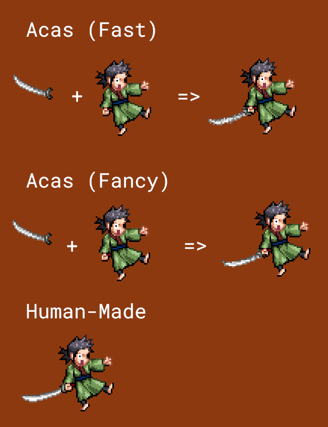

# Advanced Character Animation System

**ACAS is a set of engine-agnostic libraries and utilities to help accelerate more complex animation and manipulation of 2D Sprites** 

In the future, an SDL2 based example will be included in the examples showing off ACAS's capabilities

## Components of ACAS:

### ACAS Stitch:

> Cargo Feature Name: `acas-stitch`

Provides Powerful image manipulation utilites tailored specifically to pixel art.
- Rotation Algorithm similar to the famous rotsprite algorithm by XenoWhirl
- Stitching Capabilities: Imagine you had 5 weapons and 5 charachters and wanted every charachter to be able to use every weapon. But each charachters attack animations require these weapons to be drawn at different positions and angles, are you really going to make 25 sets of sprites for every charachter-weapon combination? With ACAS you need only draw 1 set of base sprites per charachter and 1 sprite per weapon, And with some metadata ACAS will stitch those two together with relatively good quality, thus generating your 25 sets of sprites out of just 5, All in a few milliseconds. Plus this reduces the size of your asset bundle
- There is also the super-fast version of rotation that is suited for when you need to rotating pixel art every frame while needing to be very low latency, a little noisy but can be useful for certain applications

  
<b style="color:#1077DE">Example</b>

  
  

### ACAS Core:

> Cargo Feature Name: `acas-core`

Bread and Butter of ACAS
Library for handling animation states at runtime, Keeps track of what frame to display
Additional data can tied to frame e.g iFrames for combat games, whether the current animation should lock the players ability to move e.g in Ultimate Move Animations, and any other custom flag you like
Custom Events can also be tied to frames which will be processed by polling the Event Pump/ attaching Event Handlers. This can be used to e.g tie sfx to be in sync with your animations or simplify implmenting stat counters like "Number of Attacks used"

### ACAS Compose:

> Cargo Feature Name: `acas-compose`

CLI Tool that compiles your sprites and their metadata (like custom events for acas-core) from a human readable format toml into a single file that can be quickly parsed at runtime to further reduce load times and also cuts down on your bundle size.

Alternatively you can use cargo build scripts to achieve the same thing programmatically using functions included in the acas library by default